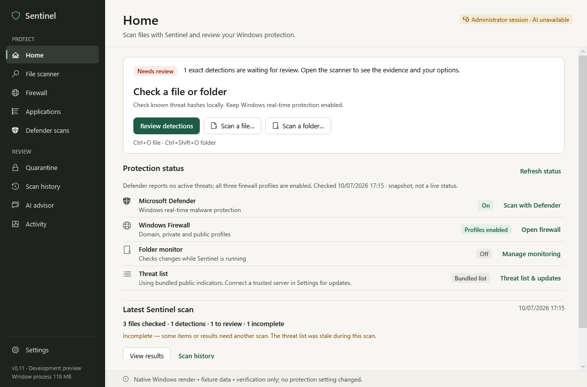
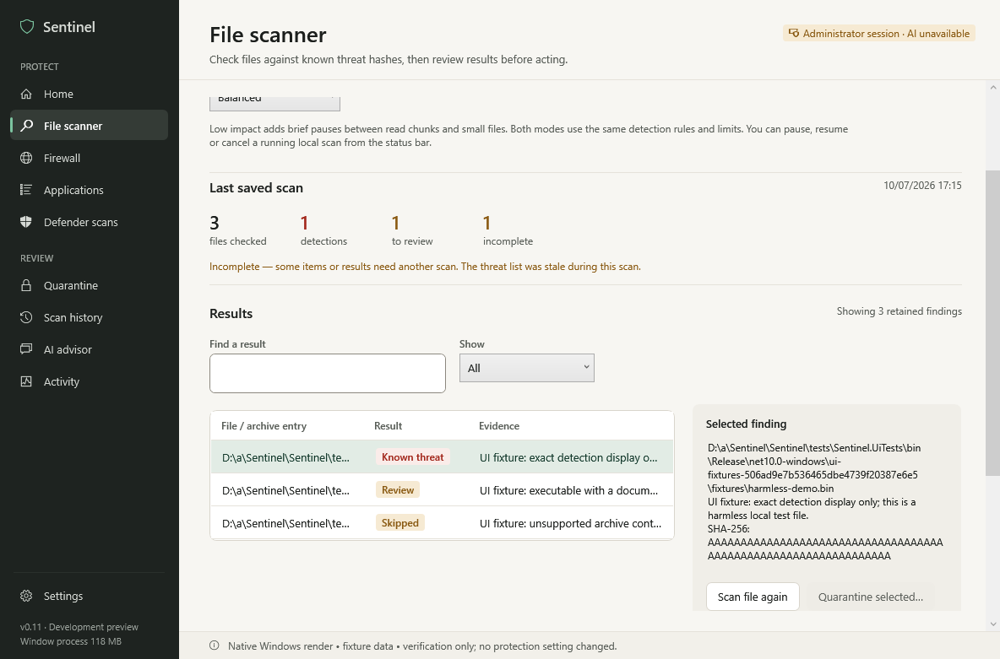
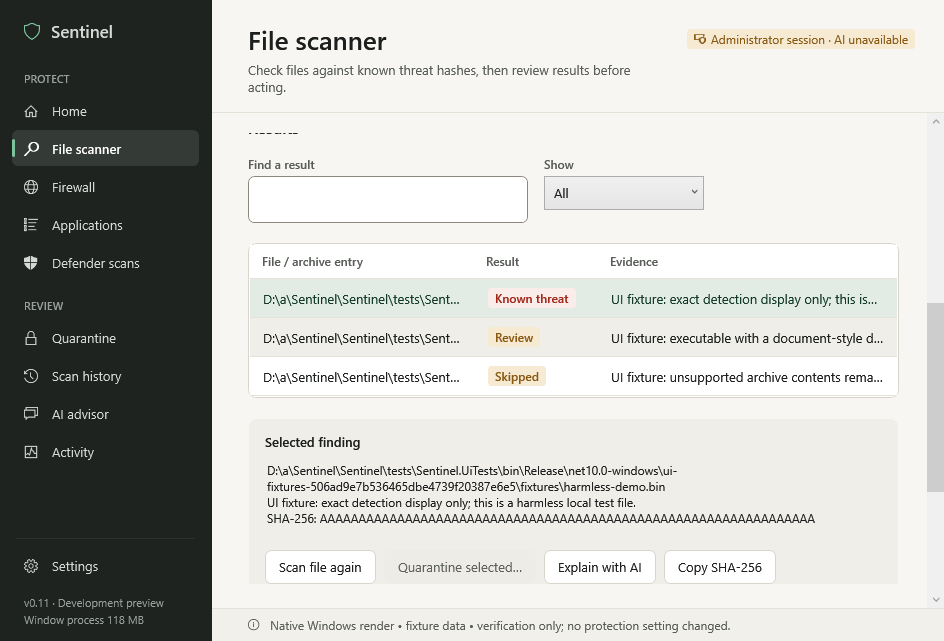

# Native Windows UI verification

The Windows CI job `ui` runs the production WPF control tree with an isolated temporary profile and injected read-only Windows status fixtures. It captures the client area using WPF's `RenderTargetBitmap` and PNG encoder. These are native WPF renders with Windows fonts and templates, not browser mockups. The status bar labels fixture data; the displayed exact detection is a harmless display fixture, not a malware sample or a claim that the host is protected.

Run on Windows with .NET 10 SDK:

```powershell
dotnet run --project tests/Sentinel.UiTests -c Release -- --output artifacts/native-ui
```

The `Native-UI` workflow artifact contains PNGs, `verification.json` and `progress.txt`. It is separate from the downloadable application packages. Captures use software rendering at 96 DPI, show the client area rather than Windows chrome, and cover every page at 1200 × 820 and 960 × 680 logical window sizes. Expanded monitoring/provider settings, selected evidence at both sizes, the system-color resource branch, busy startup and a paused local scan have additional captures. The fixture enforces its requested minimum dimensions so a small hosted display cannot silently clamp the wide arrangement; it asserts the actual window size. This does not test ordinary OS resize rules.

Assertions exercise native UI Automation invoke/disclosure patterns, page navigation during a pending status read, cancellation, fixture finding search/selection, unavailable remediation/network actions, local scan pause/resume/cancel, a subsequent scan, selected-file rescan with current-byte/history checks and settled window shutdown. Layout checks detect untrimmed single-line text wider than its arranged width and text outside the client area; WPF binding errors fail the job. Screenshots still need visual inspection, because these checks cannot assess every overlap, color or interaction.

The memory regression navigates away from twelve scanner views, forces collection after dispatcher work settles, and counts live weak references. Its managed-heap readings are diagnostic, not a process memory comparison. A separate three-second idle sample records this fixture window's CPU, working set, private bytes and managed heap. It excludes production status capture, Defender, AI, on-access drivers and real file workloads; do not infer a product ranking or ordinary-user resource requirement from it.

The test supplies no real credentials, makes no paid AI requests and does not click OS mutation actions. Harmless file scans use the actual local scanner. Temporary profile selection is internal to the test assembly; normal application startup has no environment or command-line switch for it. The runtime watchdog fails a stalled fixture run after three minutes.

This job runs on Windows x64. Windows ARM64 builds are separate; native ARM64 execution, actual OS high contrast, hardware/multiple-monitor DPI, increased Windows text size, keyboard-only usability, Narrator, UAC, DPAPI recovery, tray behavior and real enforcement still need the [Windows acceptance checks](WINDOWS-ACCEPTANCE.md). A forced system-brush branch is not a full high-contrast test.

WPF rendering follows [Microsoft's visual encoding example](https://learn.microsoft.com/en-us/dotnet/desktop/wpf/graphics-multimedia/how-to-encode-a-visual-to-an-image-file). The fixture suppresses production window creation because the [WPF application constructor queues startup before its dispatcher runs](https://source.dot.net/PresentationFramework/System/Windows/Application.cs.html).


## Recorded v0.11 candidate

[Windows run 37657526266](https://github.com/ErzenXz/Sentinel/actions/runs/37657526266) passed **116 assertions**, produced **27 captures**, and reported no binding/layout errors, with **0/12** discarded scanner views retained. Both Windows x64/ARM64 build/test/package jobs passed. New assertions exercise actual TGZ-contained review, action eligibility, history and the assembly-derived version label. The verifier executed on x64 with an elevated hosted runner; standard-user remediation and native ARM64 execution remain separate acceptance work. [Raw report](benchmarks/native-ui-v0.11-windows-x64.json).

These PNGs come from that native run. They show harmless fixture data and an administrator session; they do not describe a real user's protection status. Selected-evidence captures scroll to its actions, so some earlier/lower content lies outside the viewport and remains reachable by scrolling.








## Resource diagnostics

On Windows, `--profile --render default|software` measures fresh-window phases before/after 27 bitmap captures and while hidden/shown. Add `--after-verification` to run the normal interaction suite first, including thread CPU attribution in its original three-second sample. `verification.json` records rendering preference, tier, the scoped tiered-compilation environment setting, own-process memory/CPU, dispatcher operations and query-only thread descriptions/start modules. New/exited threads and timer quantization can make thread deltas incomplete. These routines are test-only; the product has no profiling mode.

The separate Windows resource workflow also runs a process with `DOTNET_TieredCompilation=0` to diagnose compilation warmup and compares the same core benchmark harness against v0.9. Runtime defaults remain enabled in production. The original post-verification spike is attributed to `.NET Tiered Compilation Worker`, with settled/default-rendering samples reported separately. [Full evidence, reproduction and limits](PERFORMANCE.md#v010-signed-feed-refresh-allocations-and-windows-cpu-investigation).
